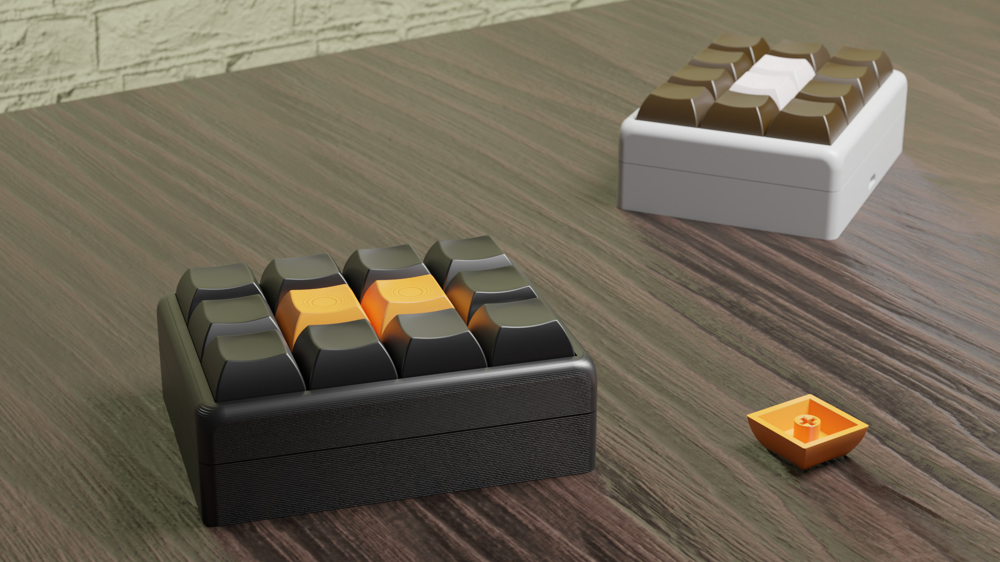
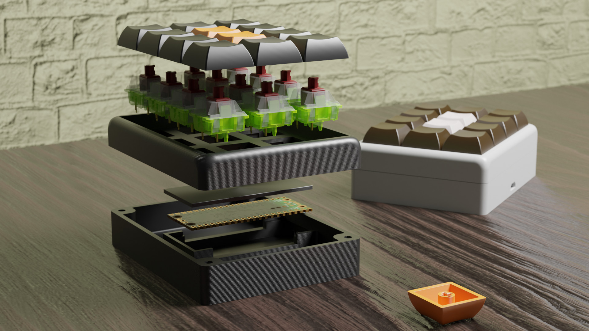
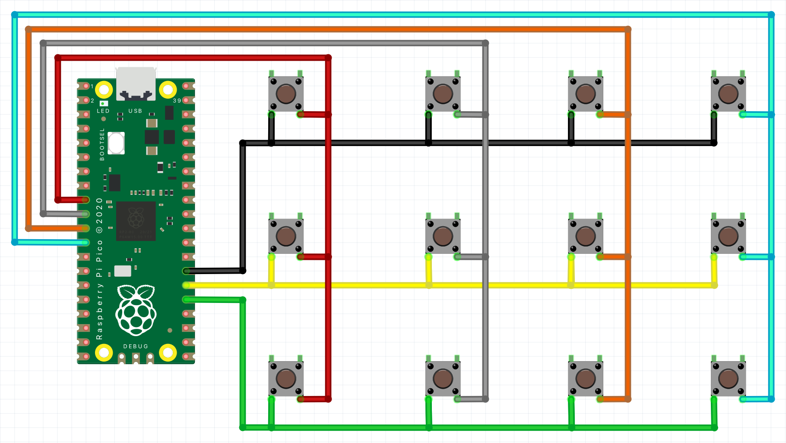

# Pico Mpad

A 3D printable macropad for automating frequently repeated actions.



## Hardware
To build this project you need access to a 3d printer. The model folder contains 4 parts, with 3 of them being the main components of body: top, bottom, lid and an additional keycap component. The keycap model contain only one instance of the keycap, make sure to print 12 of them and feel free to experiment with colours.

### Bill of materials
* Raspberry Pi Pico
* Keyboard switch (x12)
* M3x12 screw (x4)
* Connection wire

### Print
The models can be downloaded from thingiverse [here](https://www.thingiverse.com/thing:4939861).

### Assembly

1. Populate the key switches slots of the "top" printed part with the MX switches.
2. Solder the switches one to another to create a matrix as shown in the schematic.

3. Solder Pico to the matrix, make sure that wires are soldered to the bottom side of your Pico.
4. Insert the microcontroller into its slot in the "bottom" printed part.
5. Secure Pico with the "lid" printed model with the knob facing downwards.
6. Screw together the "bottom" and "top" parts with the m3 screws.
7. Put on the 3d printed "keycap"s on the key switches' tips.
8. Optionally, you can stick some rubber feet on the bottom side of the device.

## Software
### Installing CircuitPython 
The software is written in CircuitPython 6.3.0 and uses the HID module of CircuitPython Library Bundle.
1. Download the CircuitPython UF2 from the official website [here](https://circuitpython.org/board/raspberry_pi_pico/).
2. Push and hold the BOOTSEL button and plug your Pico into the USB port of your computer. Release the BOOTSEL button after your Pico is connected.
3. It will mount as a Mass Storage Device called RPI-RP2.
4. Drag and drop the CircuitPython UF2 file onto the RPI-RP2 volume. 

### Installing HID libraries
1. Download the library bundle for the CircuitPython version you installed 6.3.0 by default from [here](https://circuitpython.org/libraries)
2. Unzip the bundle; Copy `adafruit_hid` from the `lib` folder to `<CIRCUITPY DRIVE>/lib/`

### Software installation
1. Download the software
```shell
cd ~
git clone https://github.com/dr-mod/pico-mpad.git
cp pico-mpad/src/*.py <CIRCUITPY DRIVE>
```

### Configuration
To configure action modify `key_mapping.py`

At the moment there are 3 types of commands supported:
* STRING - a sequence of characters printed when a button is pressed _e.g. "Hello, world!"_
* KEY - a single key or combination of keys e.g. _A_ or _Ctrl + C_. [List](https://circuitpython.readthedocs.io/projects/hid/en/latest/_modules/adafruit_hid/keycode.html) of supported keycodes.
* CONTROL_CODE - a control commands e.g. increase brightness, [List](https://circuitpython.readthedocs.io/projects/hid/en/latest/api.html#adafruit-hid-consumer-control-code-consumercontrolcode) of supported control codes.

#### Example configuration:
```python
# ROW 1, COLUMN 1
(CONTROL_CODE, cc.PLAY_PAUSE),
# ROW 1, COLUMN 2
(CONTROL_CODE, SCAN_NEXT_TRACK),
# ROW 1, COLUMN 3
(CONTROL_CODE, SCAN_PREVIOUS_TRACK),
# ROW 1, COLUMN 4
(STRING, "sudo shutdown now \n"),
# ROW 2, COLUMN 1
(KEY, [kc.F4]),
# ROW 2, COLUMN 2
(KEY, [kc.GUI, kc.C]),
# ROW 2, COLUMN 3
(KEY, [kc.GUI, kc.V]),
# ROW 2, COLUMN 4
(CONTROL_CODE, cc.VOLUME_INCREMENT),
# ROW 3, COLUMN 1
(KEY, [kc.F20]),
# ROW 3, COLUMN 2
(KEY, [kc.ALT, kc.A]),
# ROW 3, COLUMN 3
(STRING, "Hi, this is a scripted message!"),
# ROW 3, COLUMN 4
(CONTROL_CODE, cc.VOLUME_DECREMENT)
```

### Support the project
If you would like to support what I do and keep me caffeinated, you can do it here:

[](https://www.buymeacoffee.com/drmod)